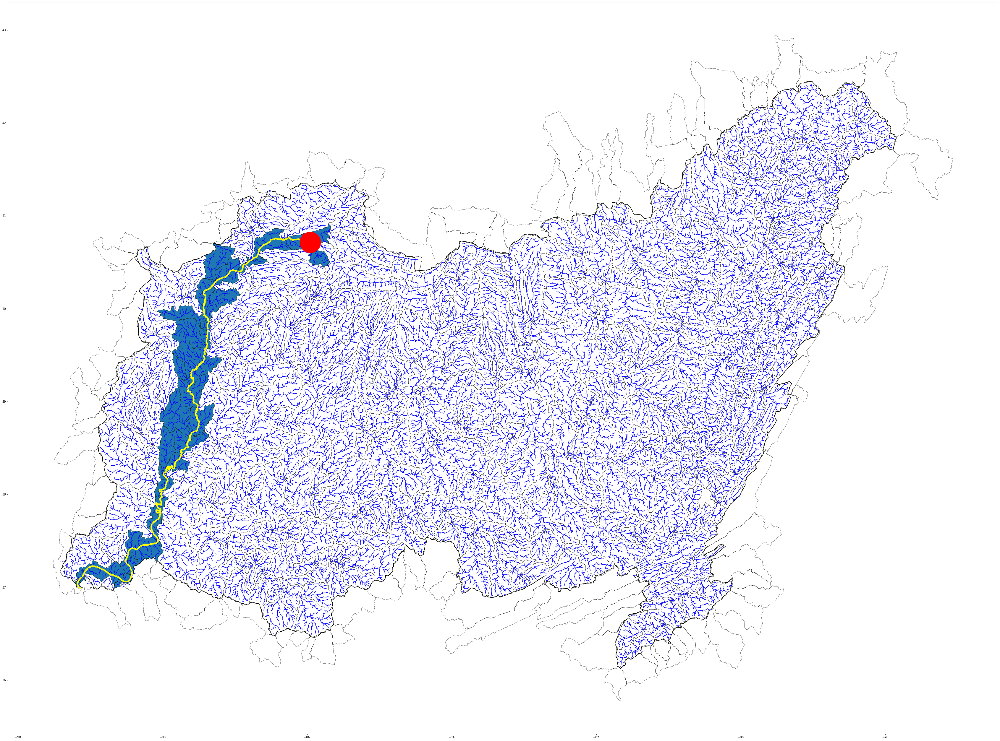
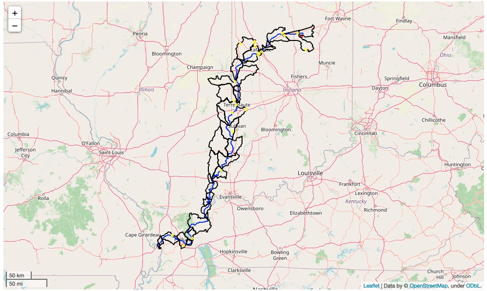

Dam Risk Assessment with HIFLD data

Homeland Infrastructure Foundation-Level Data (HIFLD) supports various formats for downloading as well as REST API via ArcGIS Online. 

This notebook demonstrates how you can access the data on HIFLD through ArcGIS REST API and CyberGISX (Keeling). It also covers a mock-up analysis in which power plants and basins would be affected if a dam fails with simple network analysis. 

